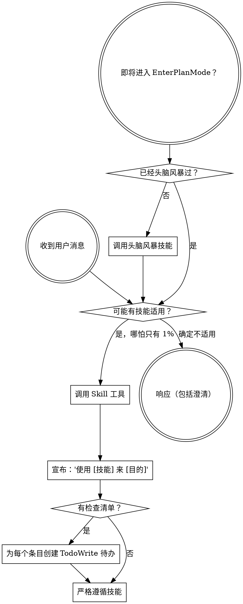

<SUBAGENT-STOP>
如果你是作为子智能体被分派来执行特定任务的，跳过此技能。
</SUBAGENT-STOP>

<EXTREMELY-IMPORTANT>
如果你认为哪怕只有 1% 的可能性某个技能适用于你正在做的事情，你绝对必须调用该技能。

如果一个技能适用于你的任务，你没有选择。你必须使用它。

这不可协商。这不是可选的。你不能通过合理化来逃避。
</EXTREMELY-IMPORTANT>

## 指令优先级

Superpowers 技能覆盖默认系统提示行为，但**用户指令始终具有最高优先级**：

1. **用户的明确指令**（CLAUDE.md、GEMINI.md、AGENTS.md、直接请求）——最高优先级
2. **Superpowers 技能** ——在冲突处覆盖默认系统行为
3. **默认系统提示** ——最低优先级

如果 CLAUDE.md、GEMINI.md 或 AGENTS.md 说"不要使用 TDD"，而某个技能说"始终使用 TDD"，遵循用户的指令。用户拥有控制权。

## 如何访问技能

**在 Claude Code 中：** 使用 `Skill` 工具。当你调用一个技能时，其内容会被加载并呈现给你——直接遵循即可。绝不要用 Read 工具读取技能文件。

**在 Copilot CLI 中：** 使用 `skill` 工具。技能从已安装的插件中自动发现。`skill` 工具的工作方式与 Claude Code 的 `Skill` 工具相同。

**在 Hermes Agent 中：** 使用 `skill_view` 工具加载技能。Hermes 支持三级渐进式加载：`skills_list` 浏览 -> `skill_view(name)` 加载完整内容 -> `skill_view(name, path)` 查看引用文件。

**在 Gemini CLI 中：** 技能通过 `activate_skill` 工具激活。Gemini 在会话开始时加载技能元数据，并按需激活完整内容。

**在其他环境中：** 查看你的平台文档了解技能的加载方式。

## 平台适配

技能使用 Claude Code 的工具名称。非 CC 平台：查看 `references/copilot-tools.md`（Copilot CLI）、`references/hermes-tools.md`（Hermes Agent）、`references/codex-tools.md`（Codex）了解工具对应关系。Gemini CLI 用户通过 GEMINI.md 自动获得工具映射。

# 使用技能

## 规则

**在任何响应或操作之前调用相关或被请求的技能。** 哪怕只有 1% 的可能性某个技能适用，你都应该调用该技能来检查。如果调用后发现技能不适合当前情况，你不需要使用它。

## 红线

这些想法意味着停下——你在合理化：

| 想法 | 现实 |
|------|------|
| "这只是一个简单的问题" | 问题就是任务。检查技能。 |
| "我需要先了解更多上下文" | 技能检查在澄清性问题之前。 |
| "让我先探索一下代码库" | 技能告诉你如何探索。先检查。 |
| "我可以快速查一下 git/文件" | 文件缺少对话上下文。检查技能。 |
| "让我先收集信息" | 技能告诉你如何收集信息。 |
| "这不需要正式的技能" | 如果技能存在，就使用它。 |
| "我记得这个技能" | 技能会迭代更新。阅读当前版本。 |
| "这不算一个任务" | 行动 = 任务。检查技能。 |
| "技能太小题大做了" | 简单的事会变复杂。使用它。 |
| "让我先做这一件事" | 在做任何事之前先检查。 |
| "这样做感觉很高效" | 无纪律的行动浪费时间。技能防止这一点。 |
| "我知道那是什么意思" | 知道概念 != 使用技能。调用它。 |

## 技能优先级

当多个技能可能适用时，使用此顺序：

1. **流程技能优先**（头脑风暴、调试）- 这些决定如何处理任务
2. **实现技能其次**（前端设计、flutter-app-dev）- 这些指导执行

"让我们构建 X" -> 先头脑风暴，再使用实现技能。
"修复这个 bug" -> 先调试，再使用领域特定技能。

## 中国特色技能路由

当检测到以下场景时，**必须**优先调用对应的中国特色技能：

| 场景 | 调用技能 |
|------|---------|
| 代码审查且团队使用中文沟通 | **superpowers:chinese-code-review** |
| 编写中文技术文档或 README | **superpowers:chinese-documentation** |

**判断依据：**
- 项目中有中文注释、中文 README -> 启用中文系列技能
- 用户用中文交流 -> 所有输出使用中文，优先考虑中国特色技能

中国特色技能与翻译技能**叠加使用**，不互斥。例如：做代码审查时，同时使用 requesting-code-review（流程）+ chinese-code-review（风格）。

## 技能类型

**刚性的**（TDD、调试、验证）：严格遵循。不要偏离纪律。

**灵活的**（模式、头脑风暴）：根据上下文调整原则。

技能本身会告诉你它属于哪种。

## 用户指令

指令说明做什么，而非怎么做。"添加 X"或"修复 Y"不意味着跳过工作流。

# Superpowers 技能索引

## 流程与纪律类

### brainstorming

**触发：** 创建功能、构建组件、添加功能或修改行为——在实现之前先探索意图、需求和设计。

**适用：** 任何创造性工作之前；需要将想法转化为设计规格；需要澄清需求、比较方案、获得用户批准。

**不适用：** 纯信息查询；bug修复（用 systematic-debugging）；任务范围和方案已经完全明确。

### systematic-debugging

**触发：** 遇到任何 bug、测试失败或异常行为时使用，在提出修复方案之前执行。

**适用：** 测试失败、生产环境bug、异常行为、性能问题、构建失败、集成问题；尤其时间紧迫或已尝试多种修复时。

**不适用：** 已明确知道根因且修复方式确定；纯需求开发。

### verification-before-completion

**触发：** 在宣称工作完成、已修复或测试通过之前使用——必须运行验证命令并确认输出后才能声称成功。

**适用：** 提交/创建PR/标记任务完成前；任何形式的成功声明；委派给代理后验收。

**不适用：** 工作仍在进行中，尚未到达验收节点。

### writing-plans

**触发：** 有规格说明或需求用于多步骤任务时使用，在动手写代码之前。

**适用：** 需要将规格拆解为可执行的小步骤任务；需要为子智能体或他人提供零上下文可执行的实现计划。

**不适用：** 单步即可完成的任务；已有实现计划只需执行（用 executing-plans）。

### executing-plans

**触发：** 有一份书面实现计划需要在单独的会话中执行，并设有审查检查点时使用。

**适用：** 计划已写好，需要逐任务执行、验证、提交；子智能体不可用时的执行方式。

**不适用：** 还没有实现计划（先写计划）；子智能体可用时优先用 subagent-driven-development。

### subagent-driven-development

**触发：** 在当前会话中执行包含独立任务的实现计划时使用。

**适用：** 计划中的任务基本独立；支持子智能体的平台；需要每个任务后两阶段审查（规格合规+代码质量）。

**不适用：** 任务紧密耦合无法隔离；子智能体不可用（用 executing-plans）。

### dispatching-parallel-agents

**触发：** 面对 2 个以上可以独立进行、无共享状态或顺序依赖的任务时使用。

**适用：** 多个测试文件因不同根因失败；多个子系统独立故障；排查之间无共享状态。

**不适用：** 失败是相关的（修复一个可能修复其他）；需要理解完整系统状态；智能体之间会互相干扰。

### finishing-a-development-branch

**触发：** 实现完成、所有测试通过、需要决定如何集成工作时使用。

**适用：** 功能开发完成需要合并/PR/清理；worktree工作需要收尾。

**不适用：** 工作尚未完成或测试未通过。

## 审查与反馈类

### requesting-code-review

**触发：** 完成任务、实现重要功能或合并前使用，用于验证工作成果是否符合要求。

**适用：** 子智能体驱动开发中每个任务完成后；完成重要功能后；合并到main之前。

**不适用：** 还没有可审查的代码变更。

### receiving-code-review

**触发：** 收到代码审查反馈后、实施建议之前使用——需要技术严谨性和验证，而非敷衍附和或盲目执行。

**适用：** 收到搭档或外部审查者的反馈；反馈不明确或技术上有疑问；需要决定接受还是反驳。

**不适用：** 反馈完全明确且无技术疑问（直接实施）。

### chinese-code-review

**触发：** 中文代码审查规范——在保持专业严谨的同时，用符合国内团队文化的方式给出有效反馈。

**适用：** 团队使用中文沟通的代码审查；需要分级标注（必须修复/建议修改/仅供参考/问题）；中英混排注释规范。

**不适用：** 团队使用英文沟通且无中文需求。

### chinese-documentation

**触发：** 中文技术文档写作规范——排版、术语、结构一步到位，告别机翻味。

**适用：** 编写中文技术文档、README、API文档；需要中英混排排版规范；需要避免机翻味和欧化句式。

**不适用：** 纯英文文档写作。

## 编码准则类

### karpathy-guidelines

**触发：** 编写、审查或重构代码时使用，减少常见 LLM 编码错误。

**适用：** 避免过度复杂化；进行外科手术式修改；显式暴露假设；定义可验证的成功标准。

**不适用：** 纯文档或非编码任务。

## 工作流类

### workflow-runner

**触发：** 在 AI 工具内运行 agency-orchestrator YAML 工作流——无需 API key，使用当前会话的 LLM 作为执行引擎。

**适用：** 用户提供 .yaml 工作流文件；要求多角色协作完成任务。

**不适用：** 单角色、单步骤任务；没有工作流文件且不需要多角色编排。
